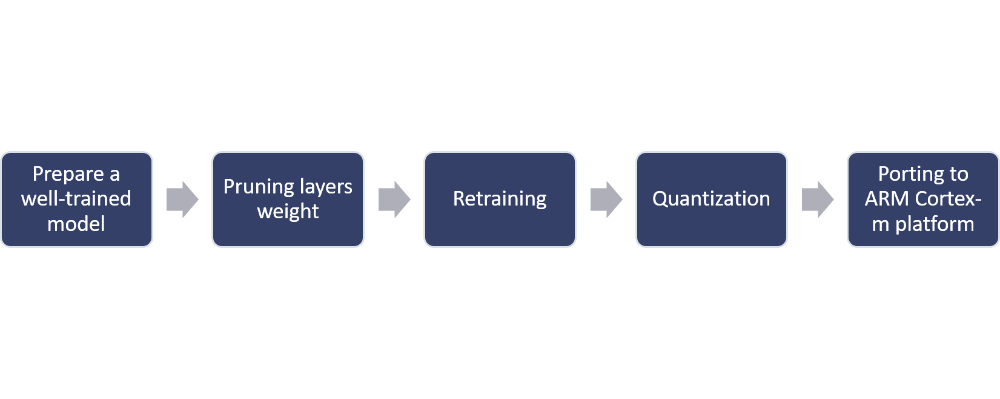
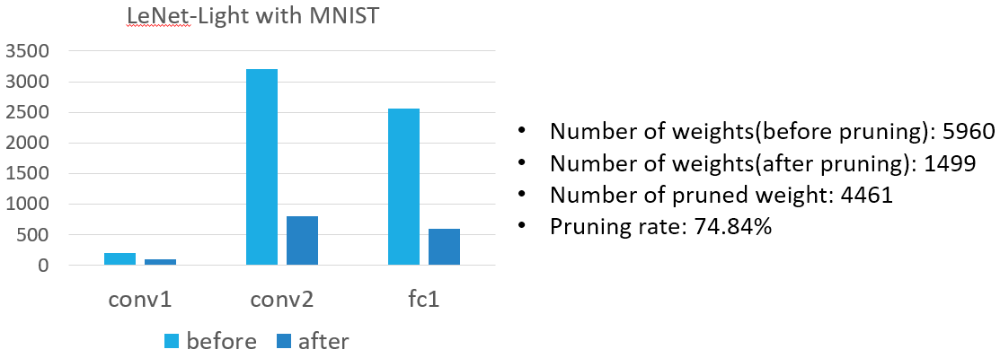
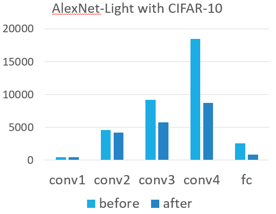
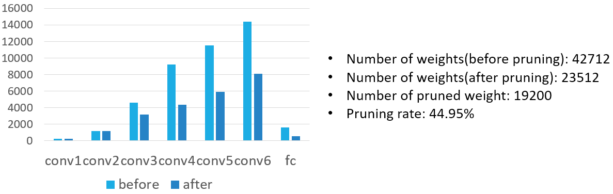

# Pruning-model-for-ARM-CortexM
I integrated two kinds of model pruning methods and porting to ARM-CortexM with CMSIS library.

## Requirement
- Pytorch(version: 1.5.0)
- [ARM-CMSIS_5](https://github.com/ARM-software/CMSIS_5)
- NuMaker-PFM-M487(development board)
- Ubuntu 16.04

## Pruning methods
- Convolutional layers pruning of [this paper](https://arxiv.org/abs/1608.08710)
- Fully-connected layer pruning of [this paper](https://arxiv.org/abs/1506.02626)

## System flow


### Example command
#### Train Alexnet-Light on CIFAR10 and prune it.
```
python pruning.py --dataset cifar10 --model alexnet-light --lr 0.001 --epochs 80 --retrain-epochs 80 --prune-layers conv1 conv2 conv3 conv4 --prune-channels 0 0 10 10 --sensitivity 0.8
```
#### Load a well-trained model and prune it.
```
python pruning.py --dataset cifar10 --model alexnet-light --lr 0.001 --retrain-epochs 80 --prune-layers conv1 conv2 conv3 conv4 --prune-channels 0 0 10 10 --sensitivity 0.8 --no-train True --load-path .\saves\alexnet_nopruned_7722_7692.ptmodel
```
#### Quantization and generate `cortexm_weight.h` for `NuMaker-PFM-M487`
```
python inference_alexnet.py
```

## Results
- Inference time was measured on NuMaker-PFM-M487.
- Accuracy was simulated on PC with CMSIS library.

#### LeNet-Light with MNIST

|                |Before| After|
|:--------------:|:----:|:----:|
| Inference time | 30ms | 22ms |
| Accuracy       |99.11%|98.55%|

#### Alexnet-Light with CIFAR10

|                |Before| After|
|:--------------:|:----:|:----:|
| Inference time | 20ms | 14ms |
| Accuracy       |76.92%|75.15%|
- The inference time of Alexnet-Light(kernel size:3x3) is higher than LeNet-Light(kernel size:5x5) because of conv kernel size.

#### VGG-Light with CIFAR10

|                |Before| After|
|:--------------:|:----:|:----:|
| Inference time | 47ms | 32ms |
| Accuracy       |78.98%|77.84%|

